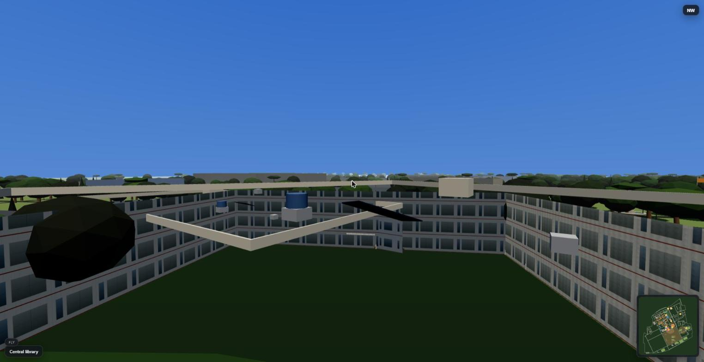
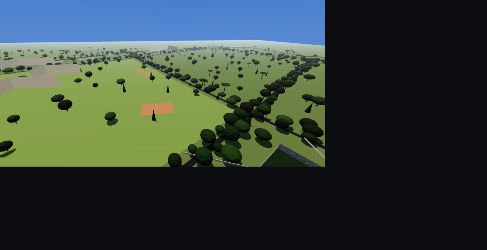

# SVNIT Surat — 3D Virtual Campus Tour

A browser-based, real-time 3D virtual tour of the campus of the **Sardar
Vallabhbhai National Institute of Technology, Surat** (SVNIT) — Ichchhanath,
Surat, Gujarat.

You walk or free-fly through a navigable 3D model of the campus whose
**layout, road network, water bodies and building footprints come from real
OpenStreetMap data**, with procedurally generated Indian-institutional
building architecture, real building name-boards, landscaping, landmarks
(Sardar Patel statue, Ganesh temple, the main gate), ambient life and sound,
a guided-tour mode, a minimap, and clickable building information.

Three buildings are enterable with hand-built interiors: the **Central
Library**, a **Lecture Theatre (LT-2)**, and the **Administration Building
lobby**.




## Run it

```bash
npm install
npm run dev        # http://localhost:5173
```

```bash
npm run build      # -> dist/  (static, deploy anywhere)
npm run preview
npm test           # Vitest
npm run lint
```

Open the dev server in a **focused browser tab** — `requestAnimationFrame`
is throttled in background tabs.

## Controls

| | |
|---|---|
| Move | `W` `A` `S` `D` / arrows |
| Look | mouse (click to lock the pointer) |
| Run | `Shift` |
| Hop | `Space` |
| Free-fly drone | `F` (then `Q`/`E` down/up, scroll = speed) |
| Full-screen map | `M` |
| Building directory | `B` |
| Building info | centre a building in the reticle, then click / `E` |
| Menu / back | `Esc` |
| Mobile | left-half move stick · right-half look drag · tap to interact · RUN latch |

## Campus data

`src/data/campus.generated.json` is **committed** and the app runs entirely
offline. It is produced by:

```bash
npm run data       # data/osm/*.json + data/campus/curated.mjs  ->  src/data/campus.generated.json
```

- `data/osm/overpass-raw.json` — a committed OpenStreetMap (Overpass API)
  export of the campus area.
- `data/campus/curated.mjs` — a hand overlay that adds department names,
  the auditorium, hostels OSM lacks, the main gate, sports grounds and
  fixes. See [`data/campus/README.md`](data/campus/README.md) to correct
  any building.

The pipeline projects lat/lon to local metres, clips to the campus polygon,
classifies buildings, estimates heights, cleans noisy/concave footprints,
and validates the result against `src/data/schema.mjs`.

## Project layout

```
scripts/            OSM -> campus.generated.json build pipeline
src/
  core/             renderer, scene manager, settings, seeded rng, perf monitor
  shared/           polygon geometry (used by pipeline + runtime)
  world/            sky, lighting, ground, roads, water, buildings, vegetation,
                    street furniture, landmarks, ambient life; Campus.js assembles it
  player/           walk + fly controller, 2D collision, teleport, mobile controls
  interiors/        room shell, furniture kit, Library / Lecture Hall / Admin, router
  ui/               loading, start menu, HUD, minimap, info panel, directory,
                    settings, credits, tour panel; GameUI wires them
  tour/             keyframe camera path, camera rig, curated route
  audio/            WebAudio synth + layered ambience
  data/             committed campus.generated.json + schema
tests/              Vitest — pipeline, geometry, collision, UI, tour, smoke
docs/               design spec, implementation plan, QA checklist, screenshots
```

## Deploy

Any static host. `netlify.toml` is included (`npm run build` → `dist/`).
For GitHub Pages, `vite.config.js` uses a relative `base`, so
`dist/` works from a subpath.

## Attribution

Campus geometry © **OpenStreetMap contributors**, licensed under the
**ODbL**. Building facades, interiors, props, audio and tour narration are
original and interpretive — they are plausible reconstructions, not exact
representations of the real buildings. This project is not affiliated with
or endorsed by SVNIT. See [`CREDITS.md`](CREDITS.md).

## Roadmap

- Swap in accurate facades/interiors where reference photos are available
- WebXR / VR mode
- More walk-in interiors
- 360° photo nodes overlaid on the model
